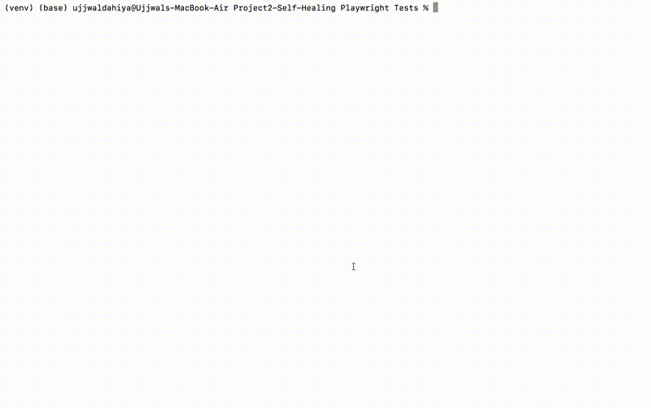

# Self-Healing Playwright Tests with AI

An AI-powered test automation framework that automatically recovers from broken 
selectors — without any manual intervention. When a UI element changes and a test 
fails to find it, the AI analyzes the page and finds the correct selector, heals 
the test, and continues execution.

---

# Self-Healing Playwright Tests with AI

An AI-powered test automation framework that automatically recovers from broken 
selectors — without any manual intervention. When a UI element changes and a test 
fails to find it, the AI analyzes the page and finds the correct selector, heals 
the test, and continues execution.

## Demo



---

## The Problem It Solves

Test brittleness is one of the biggest pain points in SDET work. When developers 
rename a button, restructure a form, or update a CSS class, automated tests break 
overnight — even though the application itself is working fine.

Traditional approach: Engineer manually finds and fixes every broken selector.
This tool: AI finds and fixes broken selectors automatically, mid-test.

---

## How It Works
Test runs normally
|
Element not found (selector is broken)
|
Self-healing kicks in
|
Captures full page HTML snapshot
|
Sends to AI: "I was looking for X, where is it now?"
|
AI analyzes HTML and returns correct selector
|
Test retries with healed selector and passes
|
Fix is cached so AI is never called twice for the same issue

---

## Tech Stack

- Python 3.14
- Playwright (browser automation)
- Groq API (free tier)
- LLaMA 3.3 70B model
- JSON (selector cache storage)

---
## Project Structure
```
Project2-Self-Healing Playwright Tests/
├── tests/
│   └── test_login.py       <- Playwright test with self-healing built in
├── utils/
│   └── healer.py           <- AI brain that finds broken selectors
├── healed_selectors.json   <- Cache of previously healed selectors
├── requirements.txt
└── package.json
```
---

## Setup and Installation

### 1. Clone the repository
```bash
git clone https://github.com/your-username/self-healing-playwright-tests.git
cd self-healing-playwright-tests
```

### 2. Create and activate virtual environment
```bash
python3 -m venv venv
source venv/bin/activate
```

### 3. Install Python dependencies
```bash
pip install -r requirements.txt
```

### 4. Install Playwright browsers
```bash
python3 -m playwright install chromium
```

### 5. Install Node dependencies
```bash
npm install
```

### 6. Set your Groq API key
Get a free API key from https://console.groq.com
```bash
export GROQ_API_KEY="your-api-key-here"
```

### 7. Run the test
```bash
python3 tests/test_login.py
```

---

## Sample Output

### First Run (AI heals the broken selector)
```
[TEST] Navigating to https://the-internet.herokuapp.com/login
[TEST] Filling in username...
[TEST] Filling in password...
[TEST] Looking for element: '#broken-login-btn'
[TEST] Element NOT found. Starting self-healing process...
[HEALER] No cache found for '#broken-login-btn'. Asking AI...
[HEALER] AI returned new selector: 'button.radius'
[TEST] Retrying with healed selector: 'button.radius'
[TEST] Element found after healing.
[TEST] LOGIN SUCCESSFUL - Test Passed.
```
### Second Run (uses cached fix, no AI call needed)
```
[TEST] Looking for element: '#broken-login-btn'
[TEST] Element NOT found. Starting self-healing process...
[HEALER] Found cached fix for '#broken-login-btn' -> 'button.radius'
[TEST] Retrying with healed selector: 'button.radius'
[TEST] Element found after healing.
[TEST] LOGIN SUCCESSFUL - Test Passed.
```
---

## Key Engineering Decisions

- **Selector caching** — healed selectors are stored in a local JSON file so the 
  AI is never called twice for the same broken selector, saving API calls and time
- **HTML slicing** — page HTML is trimmed to 8000 characters before sending to 
  the AI to stay within token limits while preserving enough context
- **Graceful fallback** — if the AI cannot find a working selector, the test 
  raises a clear descriptive error instead of a cryptic crash
- **headless=False** — browser runs visibly during development so you can watch 
  the test execute in real time

---

## Business Value

Reduces time spent fixing broken selectors by up to 90% in stable UI environments.
Keeps CI pipelines green even after minor UI changes.
Frees SDETs from repetitive selector maintenance work.

---

## Future Improvements

- [ ] Support for multiple pages and test scenarios
- [ ] Slack or email notification when a selector is healed
- [ ] Auto-update the source test file with the healed selector permanently
- [ ] Support for XPath selectors in addition to CSS
- [ ] Dashboard to track healing history over time

---

## Author
```
Ujjwal Dahiya
Masters Student | Aspiring SDET
GitHub: https://github.com/ujjwaldahiya399
```